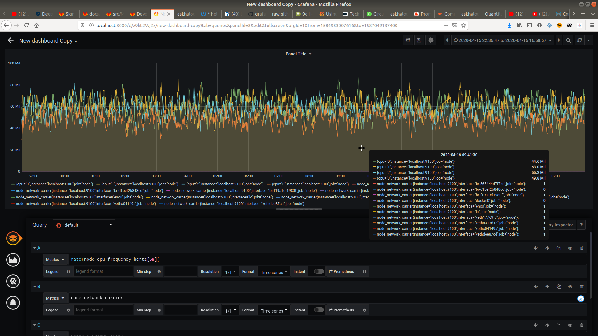
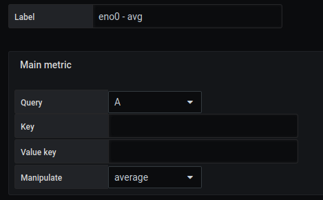
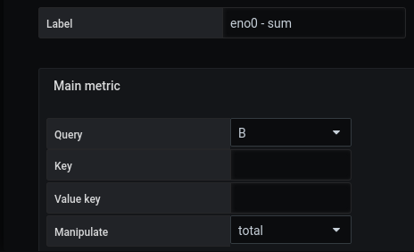
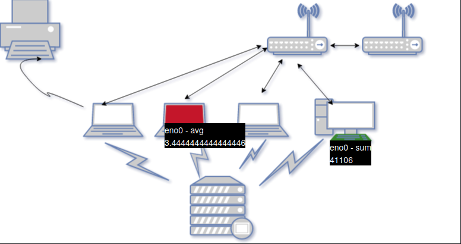

 
# Créer une modélisation avancée

## Sélectionner une requête

Choisissons ces deux requêtes :

- node_cpu_frequency_hertz
- node_network_carrier_changes_total


Voir ce qu'ils rapportent :



node_cpu_frequency_hertz


```
node_cpu_frequency_hertz{cpu="0",instance="localhost:9100",job="node"}
node_cpu_frequency_hertz{cpu="1",instance="localhost:9100",job="node"}
node_cpu_frequency_hertz{cpu="2",instance="localhost:9100",job="node"}
node_cpu_frequency_hertz{cpu="3",instance="localhost:9100",job="node"}

```

node_network_carrier

```

node_network_carrier_changes_total{instance="localhost:9100",interface="br-565444d7f7ec",job="node"}
node_network_carrier_changes_total{instance="localhost:9100",interface="br-d1bef2b848cd",job="node"}
node_network_carrier_changes_total{instance="localhost:9100",interface="br-f19a1cf1980f",job="node"}
node_network_carrier_changes_total{instance="localhost:9100",interface="docker0",job="node"}
node_network_carrier_changes_total{instance="localhost:9100",interface="eno0",job="node"}
node_network_carrier_changes_total{instance="localhost:9100",interface="lo",job="node"}
node_network_carrier_changes_total{instance="localhost:9100",interface="veth17769f7",job="node"}
node_network_carrier_changes_total{instance="localhost:9100",interface="vetha317d1e",job="node"}
node_network_carrier_changes_total{instance="localhost:9100",interface="vethc04149a",job="node"}
node_network_carrier_changes_total{instance="localhost:9100",interface="vethdee87cd",job="node"}

```

Il y a beaucoup de valeurs, donc nous devons les manipuler pour arriver à une valeur cohérente.

## Créer des régions et manipuler la métrique

### Étape 1 : Importer notre SVG

L'ajout d'une image de fond se fait à partir du menu `display`.

L'image sélectionnée sera [demo1-background.svg](../../resource/demo1-background.svg). Pour ce faire, nous la téléchargeons en base64 avec la fonction `Copier l'adresse de l'image`.

Il est possible d'avoir plus de détails avec la page [display](../editor/display.md).

Vous devez sauvegarder et recharger la page.

### Étape 2 : Créer la région

Nous allons créer deux régions

Pour cette étape, vous pouvez suivre le [tutorial2](tutorial2.md) pour créer votre région et ajouter des couleurs

### Etape 3 : Ajouter une métrique principale à la région et manipuler les données

Une fois les régions créées, allez dans la rubrique `Main metric` et ajoutez une de celle que vous avez definis.

Vous pouvez ensuite choisir entre `manipulate the average`, si vous voulez une moyenne des valeurs métriques. Ou  `manipulate the total`, si vous voulez une somme des valeurs de la métrique.






Si votre mesure ne doit renvoyer qu'une seule valeur, vous devez sélectionner "erreur de manipulation". 
Cela affichera sa valeur, si elle est unique, et affichera une erreur s'il y a d'autres valeurs.





