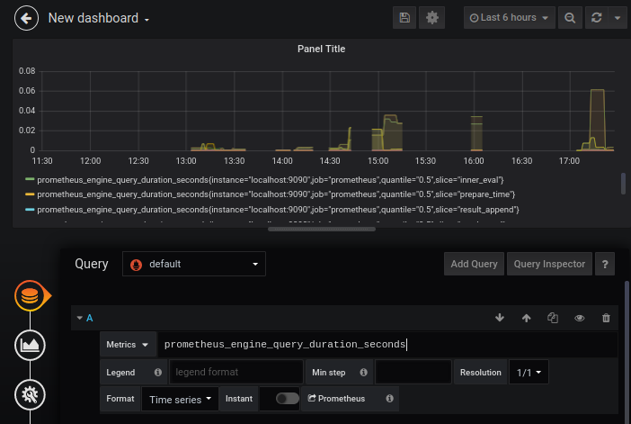
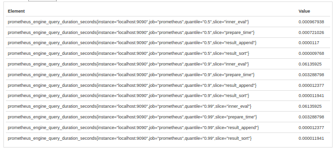
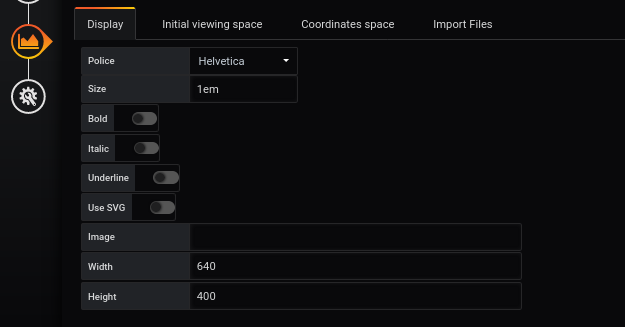
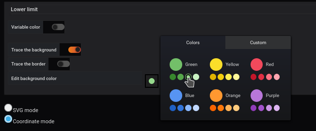
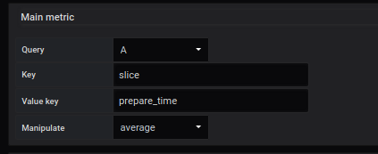
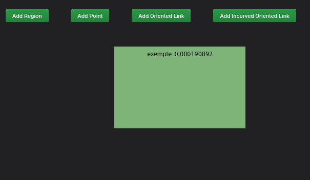
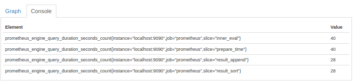
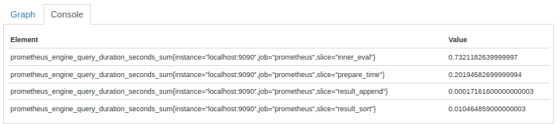

 
# Create a customizable query avanced

## Add a query in Grafana

The example shows how to use query filters to obtain precise metrics





In a query, we want to analyze what the network card receives


```
prometheus_engine_query_duration_seconds

```


The result shows several possible outcomes

order by quantile

```

prometheus_engine_query_duration_seconds{instance="localhost:9090",job="prometheus",quantile="0.5",slice="inner_eval"}
prometheus_engine_query_duration_seconds{instance="localhost:9090",job="prometheus",quantile="0.5",slice="prepare_time"}
prometheus_engine_query_duration_seconds{instance="localhost:9090",job="prometheus",quantile="0.5",slice="result_append"}
prometheus_engine_query_duration_seconds{instance="localhost:9090",job="prometheus",quantile="0.5",slice="result_sort"}
prometheus_engine_query_duration_seconds{instance="localhost:9090",job="prometheus",quantile="0.9",slice="inner_eval"}
prometheus_engine_query_duration_seconds{instance="localhost:9090",job="prometheus",quantile="0.9",slice="prepare_time"}
prometheus_engine_query_duration_seconds{instance="localhost:9090",job="prometheus",quantile="0.9",slice="result_append"}
prometheus_engine_query_duration_seconds{instance="localhost:9090",job="prometheus",quantile="0.9",slice="result_sort"}
prometheus_engine_query_duration_seconds{instance="localhost:9090",job="prometheus",quantile="0.99",slice="inner_eval"}
prometheus_engine_query_duration_seconds{instance="localhost:9090",job="prometheus",quantile="0.99",slice="prepare_time"}
prometheus_engine_query_duration_seconds{instance="localhost:9090",job="prometheus",quantile="0.99",slice="result_append"}
prometheus_engine_query_duration_seconds{instance="localhost:9090",job="prometheus",quantile="0.99",slice="result_sort"}


```


in Prometheus




Order by slice

```

prometheus_engine_query_duration_seconds{instance="localhost:9090",job="prometheus",quantile="0.5",slice="inner_eval"}
prometheus_engine_query_duration_seconds{instance="localhost:9090",job="prometheus",quantile="0.9",slice="inner_eval"}
prometheus_engine_query_duration_seconds{instance="localhost:9090",job="prometheus",quantile="0.99",slice="inner_eval"}
prometheus_engine_query_duration_seconds{instance="localhost:9090",job="prometheus",quantile="0.5",slice="prepare_time"}
prometheus_engine_query_duration_seconds{instance="localhost:9090",job="prometheus",quantile="0.9",slice="prepare_time"}
prometheus_engine_query_duration_seconds{instance="localhost:9090",job="prometheus",quantile="0.99",slice="prepare_time"}
prometheus_engine_query_duration_seconds{instance="localhost:9090",job="prometheus",quantile="0.5",slice="result_append"}
prometheus_engine_query_duration_seconds{instance="localhost:9090",job="prometheus",quantile="0.9",slice="result_append"}
prometheus_engine_query_duration_seconds{instance="localhost:9090",job="prometheus",quantile="0.99",slice="result_append"}
prometheus_engine_query_duration_seconds{instance="localhost:9090",job="prometheus",quantile="0.5",slice="result_sort"}
prometheus_engine_query_duration_seconds{instance="localhost:9090",job="prometheus",quantile="0.9",slice="result_sort"}
prometheus_engine_query_duration_seconds{instance="localhost:9090",job="prometheus",quantile="0.99",slice="result_sort"}


```


## Editor

Dans Diplay




Region







resultat




## File JSON


```

    "mainMetric": {
      "key": "slice",
      "unit": "",
      "format": "",
      "keyValue": "prepare_time",
      "refId": "A",
      "expr": "",
      "returnQuery": [
        {
          "name": "prometheus_engine_query_duration_seconds{instance=\"localhost:9090\",job=\"prometheus\",quantile=\"0.5\",slice=\"prepare_time\"}",
          "refId": "A",
          "fields": [
            {
              "name": "prometheus_engine_query_duration_seconds{instance=\"localhost:9090\",job=\"prometheus\",quantile=\"0.5\",slice=\"prepare_time\"}",
              "type": "number",
              "config": {},
              "values": {
                "buffer": [
                ]
              },
              "labels": {
                "instance": "localhost:9090",
                "job": "prometheus",
                "quantile": "0.5",
                "slice": "prepare_time"
              },
              "calcs": null
            },
            {
              "name": "Time",
              "type": "time",
              "config": {},
              "values": {
                "buffer": [
                ]
              },
              "calcs": null
            }
          ],
          "length": 1
        }
      ],
      "manageValue": "avg"
    },
    
```


## Utilisez plutot


prometheus_engine_query_duration_seconds_count





prometheus_engine_query_duration_seconds_sum 





