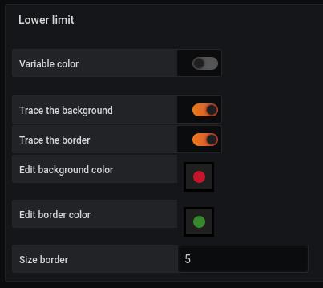
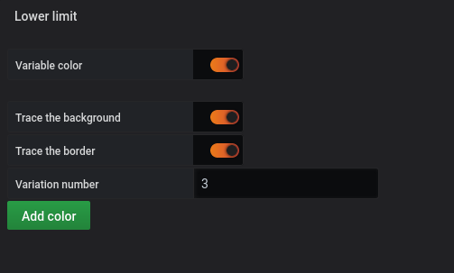

# Lower limit

Cette partie est commune pour

- [Region](coordinates-space-region.md)
- [Point](coordinates-space-point.md)

### Fixe color

Si la `variable color` est décoché, un formulaire de ce type apparait

- Trace the background : En cochant cette case, donne la possibilité de modifier la couleur du background
- Trace the border : En cochant cette case, donne la possibilité de modifier la couleur de la bordure
- Edit background color : En cliquant sur le rond, vous pouvez choisir la couleur désiré
- Edit border color : En cliquant sur le rond, vous pouvez choisir la couleur désiré
- Size border : Vous permet de choisir la taille de la bordure

### Variable color

Si la `variable color` est coché, un nouveau formulaire apparaît pour définir le nombre de palier nécessaire comme ceci :

Renseigner le nombre de palier (par défaut 3)
Cliquez sur `add color`

Vous obtenez cet écran :

Chaque palier, vous devez remplir :

- Une valeur minimum
- Une valeur maximum
- Choisir une couleur intérieure
- Choisir une couleur de bordure

# Voir aussi

- [Tutorial 07 : Créer un lien bi directionnel](../demo/tutorial07.md)
- [Tutorial 14 : Gabarit dynamique avancé](../demo/tutorial14.md)
