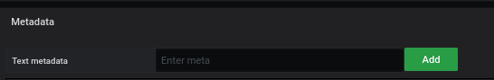
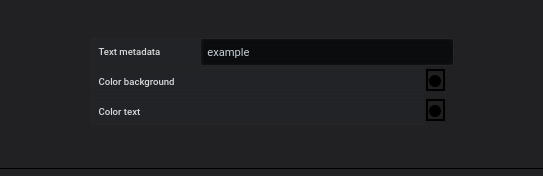
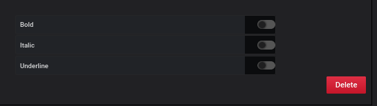

# Metadata

Cette partie est commune pour

- [Region](coordinates-space-region.md)
- [Point](coordinates-space-point.md)
- [Oriented Link](coordinates-space-link.md)

Les métadonnées permettent d'afficher un ou plusieurs messages.

Après avoir cliqué sur le bouton `add`, un écran de configuration est offert comme ceci :

Vous pouvez choisir la forme du message :

  - Une couleur de texte
  - Une couleur de fond
  - Choisissez un style : Gras, Italique, Souligné

Pour chaque ligne, il est possible de la supprimer.

Tous les méta seront affichés lorsque vous passerez la souris sur l'objet

# Voir aussi

- [Tutorial 02 : Ajoutez PNG/JPG dans votre tableau de bord](../demo/tutorial02.md)
- [Tutorial 03 : Créer un dashboard avancé avec des liens directionnels](../demo/tutorial03.md)
- [Tutorial 08 : Comment utiliser la métrique auxiliaire](../demo/tutorial08.md)
