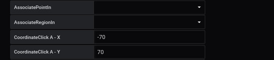
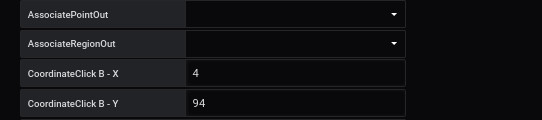
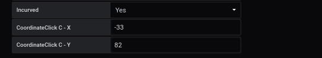
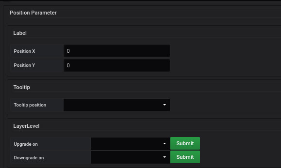

# Oriented Link

L'ajout d'un nouveau [lien orienté](../panel/panel-oriented-link.md) ou un [lien incurvé](../panel/panel-incurved-link.md) se fait à partir du menu du panel.

Vous pouvez modifier les coordonnées d'un oriented link ci-dessous : 

## Informations obligatoires

les informations obligatoires pour afficher les points sont : 

### Label 

il s'agit d'une clé permettant d'ajouter le résultat d'une valeur à des paramètres 

### orientation

2 orientations sont possibles : 

- monodirectionnel
- birectionnel

### Taille

Vous permet de choisir la taille du lien entre Small, Medium et Large

## Associate Point/Region In

Vous permet de définir l'objet de départ de votre lien. 

Pour cela vous pouvez l'associer à un point et/ou une région.

Si vous ne l'associez, vous saisissez les coordonnées (X et Y) de départ.

## Associate Point/Region Out

Vous permet de définir l'objet d'arrivée de votre lien. 

Pour cela vous pouvez l'associer à un point et/ou une région.

Si vous ne l'associez, vous saisissez les coordonnées (X et Y) de d'arrivée.

## Incurved

Il est possible d'ajouter un point supplémentaire pour faire une courbe.

Pour cela, vous devez dire **oui** au champ **incurved** pour ajouter un nouveau point C en position X et Y.

## Autre paramètre

### Main metric

Une page dédiée, pour remplir les champs, est disponible [ici](coordinates-main-metric.md)

### Auxiliary metrics

Une page dédiée, pour remplir les champs, est disponible [ici](coordinates-auxiliary-metric.md)

### Manage link

Une page dédiée, pour remplir les champs, est disponible [ici](coordinates-manage-link.md)

### Text object

Une page dédiée, pour remplir les champs, est disponible [ici](coordinates-object-text.md)

### Lower Limit

Une page dédiée, pour remplir les champs, est disponible [ici](coordinates-lower-limit.md)

### Position Parameter

Vous pouvez définir la position du e différent paramètre.

  - La position du label en X et Y suivant la position in (A) et out (B)

  - La position tooltip : 
    - haut
    - bas
    - droite
    - gauche

  - Layer level
    - Upgrade on : choisissez l'autre lien que vous voulez voir en dessous de celui ci
    - Downgrade on : choisissez l'autre lien que vous voulez voir au-dessus de celui-ci

