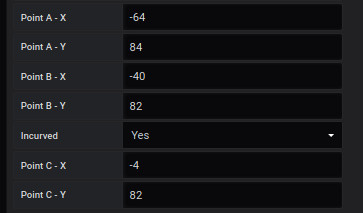

# oriented Link
Définir les coordonnées d'un oriented link

## **Informations obligatoires**

les informations obligatoires pour afficher les points sont : 

## Label 

il s'agit d'une clé permettant d'ajouter le résultat d'une valeur à des paramètres 

## orientation

2 orientations sont possibles : 

- monodirectionnel
- birectionnel

## Size

Vous permet de choisir la taille du lien entre Small, Medium et Large

## AssociatePoint/RégionIn et AssociatePoint/RégionOut

Vous permet de définir l'objet de départ et d'arrivée de votre lien, il peut s'agir d'un lien entre des points et/ou des régions.

## CoordinatClickA/B-X/Y

Si le lien n'est pas associé à un objet, ces entrées sont utilisées pour définir les points de départ et d'arrivée du lien.

## Incurved

Il est possible d'ajouter un point pour faire une courbe.

Pour ce faire, vous ajoutez un nouveau point C en position X et Y.

## **Autre paramètre**

## Main metric

Une page dédiée pour remplir les champs sont disponible [ici](coordinates-space-main-metric.md)

## Auxiliary metrics

Une page dédiée pour remplir les champs sont disponible [ici](coordinates-auxiliary-metric.md)

## Manage link

Une page dédiée pour remplir les champs sont disponible [ici](coordinates-manage-link.md)

## Text object

Une page dédié pour remplir les champs sont disponible [ici](coordinates-text-object.md)

## LowerLimit

Une page dédié pour remplir les champs sont disponible [ici](coordinates-lower-limit.md)

## Position Parameter

Vous pouvez définir la position du e différent paramètre.

  - La position du label en X et Y

  - La position tooltip : 
haut / bas....

  - Layer level

