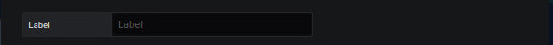

# Région

Permet la création d'une région

## Informations obligatoires

### Label

Il s'agit d'une clé permettant d'ajouter le résultat d'une valeur à des paramètres.

Ce champ est obligatoire.

### SVG mode

Il faut que la ligne **svg mode** soit cocher pour accéder à la configuration de la région.

Permet de définir un élément SVG comme une région.

La liste déroulante affiche les clefs ID des fichiers SVG. Il s'agit d'un champ autocomplète, c'est à dire en tapant les premières lettes, vous trouverez plus facilement l'élément que vous recherchez.

### Coordinate region

Il faut que la ligne **coordinate mode** soit cocher pour accéder à la configuration de la région.

Permet de définir les coordonnées d'une région sur la même base que l'onglet "Initial viewing space".

Il est possible d'ajouter le lien d'une image dans la région que vous avez terminé. Celle-ci prendra les dimensions de la région.

Une représentation graphique sera :

Si vous avez choisi d'ajouter, il faut cliquer sur **save** Si vous êtes en mode édition, la mise à jour sera automatique

## Main metric

Une page dédiée, pour remplir les champs, est disponible [ici](coordinates-main-metric.md)

## Auxiliary metrics

Une page dédiée, pour remplir les champs, est disponible [ici](coordinates-auxiliary-metric.md)

## Manage link

Une page dédiée, pour remplir les champs, est disponible [ici](coordinates-manage-link.md)

## Text object

Une page dédiée, pour remplir les champs, est disponible [ici](coordinates-object-text.md)

## Lower Limit

Une page dédiée, pour remplir les champs, est disponible [ici](coordinates-lower-limit.md)
