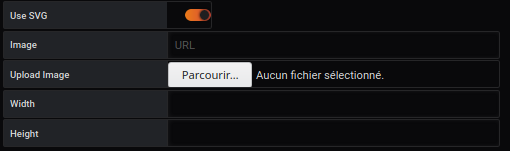
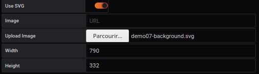

# Display

## Police de caractères

La liste des polices utilise les polices standard qui sont disponibles dans le navigateur.

Vous pouvez choisir la police suivante :

- "Helvetica"
- "Arial"
- "sans-serif"
- "mono"

## Taille

Permet de pouvoir choisir la taille de la police en `em`

Exemple: `1em` à `4em`.

## Style

Différents styles sont possibles : gras, italique, souligné, etc.

- blod : "true" ou "false" pour mettre le texte en gras
- italic : "true" ou "false" pour mettre le texte en italique
- underline : "true" ou "false" pour mettre le texte en évidence

## Utiliser SVG

Permet de télécharger un SVG pour pouvoir gérer les régions. En décochant, vous pouvez télécharger n'importe quelle image, mais elle ne sera pas interactive

# Image

Il est important de définir un espace pour délimiter son environnement, pour cela vous pouvez télécharger

- Image Vectoriel
- Si vous n'utilisez pas une image SVG (JPG / PNG / GIF ou aucune)
- Choisir une image depuis son ordinateur
- base 64

Pour cela, il est possible de charger une image en arrière-plan suivant une des méthodes proposées :

## Si vous utilisez une image SVG

### Image Vectoriel

Il s'agit d'une image vectorielle au format SVG. La création du fichier SVG est décrite dans la page dédiée : [Construire un fichier SVG](../appendix/svg.md)

## Si vous n'utilisez pas une image SVG

### Image Bitmap

Il s'agit d'une image créée point par point dont le contenu n'est dynamique, ni vectoriel

Il est possible de charger une image en arrière-plan au format :

- JPG ou JPEG
- PNG
- GIF

Il faut renseigner l'espace nécessaire pour créer votre environnement

- Largeur
- Hauteur

pour obtenir le résultat suivant

#### Pas d'image d'arrière plan

Vous devez remplir l'espace requis pour créer votre environnement sans image de fond :

- Largeur (en pixel)
- Hauteur (en pixel)

pour obtenir le résultat suivant :

## Choisir une image depuis son ordinateur

Il est possible de charger une image en arrière plan depuis son ordinateur. Elle sera chargée une fois et se positionnera en fond d'écran.

Elle peut être dans un format possible (SVG / JPG / PNG / GIF)

A partir du sélecteur, vous choississez le fichier de votre choix. Après la confirmation, l'image sera affiché et les champs de l'éditeur complété pour obtenir le résultat suivant :

## base 64

Il est possible de charger une image en _base 64_ comme ceci :

pour cela, il faut _copier l'adresse de l'image_

# Voir aussi

- [Tutorial 01 : Ajoutez SVG dans votre tableau de bord](../demo/tutorial01.md)
- [Tutorial 02 : Ajoutez PNG/JPG dans votre tableau de bord](../demo/tutorial02.md)
- [Tutorial 03 : Créer un dashboard avancé avec des liens directionnels](../demo/tutorial03.md)
- [Tutorial 09 : Comment créer une région en mode coordonnée](../demo/tutorial09.md)
