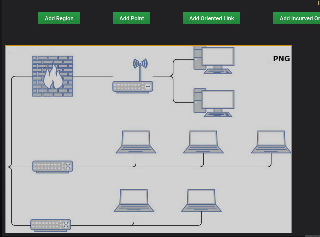
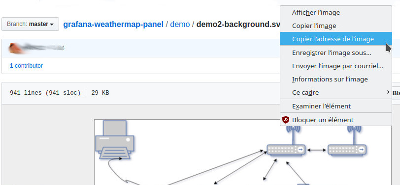

# Display

- Police de caractères

La liste de police de caractères utilise celle standard qui sont disponible dans le navigateur

- Taille

Permet de pouvoir choisir la taille de la police 

- Style

Différents styles sont possibles : gras, italique, souligné, etc.

- Utiliser SVG

Permet de télécharger un svg pour pouvoir gérer les régions. En décochant, vous pouvez telecharger n'importe quelle image mais elle ne sera pas interactive

# Image

Il est important de définir un espace pour délimiter son environnement

Pour cela, il est possible de charger une image en arrière plan suivant une des méthodes proposées : 

## Si vous utilisez une image SVG

### Image Vectoriel

Il s'agit d'une image vectoriel au format SVG. La création du fichier SVG est décrite dans la page dédié : [Construire un fichier SVG](../appendix/svg.md)

Après avoir saisie l'url du fichier

Il faut sauvegarder le dashboard, comme ceci

## Si vous n'utilisez pas une image SVG

### Image Bitmap

Il s'agit d'une image créé point par point dont le contenu n'est dynamique, ni vectoriel

Il est possible de charger une image en arrière plan au format : 

- JPG ou JPEG
- PNG
- GIF

Il faut renseigner l'espace nécessaire pour créer votre environnement

- Largeur
- Hauteur

pour obtenir le résultat suivant

Après avoir saisie l'url du fichier, la largeur et la hauteur

Il faut sauvegarder le dashboard, comme ceci

## base 64

Il est possible de charger une image en *base 64* comme ceci : 

pour cela, il faut *copier l'adresse de l'image*

Après avoir saisie l'url du fichier

Il faut sauvegarder le dashboard, comme ceci

