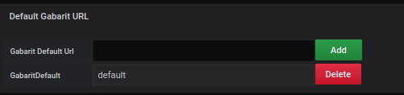
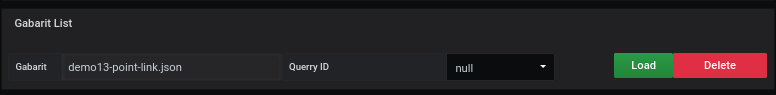

# Gabarit Files

## Default Gabarit URL

Pour le Global import, il faut renseigner le lien du fichier .json qui comprend toutes les informations necessaire pour remplir le dashboard.

Vous saisissez l'url du fichier et cliquer sur le bouton **Add**.

Le résultat est instantanné

La décomposition du fichier [gabarit.json](../appendix/gabarit.md) est disponible avec tous les détails.

## URL List

TODO

Après, vous cliquez sur le bouton `add` si vous voulez ajouter d'autres URL
Pour finir il faut cliquer sur `finish`

Le résultat est instantanné

Vous pouvez ajouter à volonter des fichiers d'import supplémentaires

## Gabarit List

TODO

# Voir aussi

- [tutorial 13](../demo/tutorial13.md)
- [tutorial 14](../demo/tutorial14.md)
