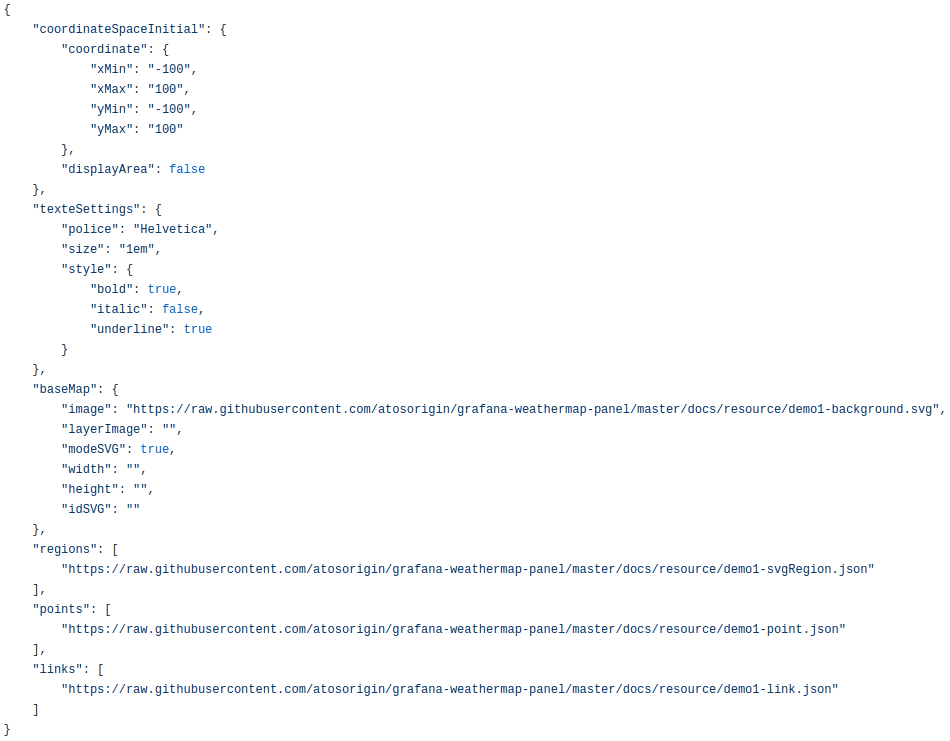

 
# Import Files

 
## Global URL Import

Pour le Global import, il faut renseigner le lien du fichier .json qui comprend toutes les informations necessaire comme si dessous.

Avec :
	
- coordinateSpaceInitial	
    - coordinate : Vous permet de redimensionner votre esapace de travail. Les axes X et Y allant de -100% à plus 100%. 
    - displayArea : "True" ou "False" pour montrer l'espace de travail
- texteSettings	
    - police : Choix de la police du texte entre "Helvetica", "Arial", "sans-serif", "mono"
    - size : Choix de la taille du texte en "em". Exemple : "1em" ou "4em"
    - style	
        - bold : "True" ou "False" pour mettre le texte en gras
        - italic : "True" ou "False" pour mettre le texte en italique
        - underline : "True" ou "False" pour mettre le texte en sousligné
- baseMap	
    - image	: permet de renseigner le lien de l'image, en base 64 ou avec un URL
    - layerImage : ""
    - modeSVG : "True" ou "False" si vous utilisez une image SVG
    - width	: Choix de la largeur si vous n'avez pas une image SVG. Si vous en avez une, laissez vide
    - height : Choix de la hauteur si vous n'avez pas une image SVG. Si vous en avez une, laissez vide
    - idSVG	""
- regions	
    - 0 : Lien vers le fichier .json des régions [Cliquer ici pour savoir comment les remplir](./../appendix/json-region.md)
- points	
    - 0 : Lien vers le fichier .json des points [Cliquer ici pour savoir comment les remplir](./../appendix/json-point.md)
- links	
    - 0 : Lien vers le fichier .json des links [Cliquer ici pour savoir comment les remplir](./../appendix/json-links.md)
 
## Multi URL Import

Pour le Multi URL Import, il vous faut saisir les différents URL necessaire dans le champ. 
Les différents URL sont ceux des régions, des points, et des liens. 
Vous trouverez des modèles de json type de ces fichiers aux liens suivant :

- [region.json](./../appendix/json-region.md)
- [point.json](./../appendix/json-points.md)
- [lien.json](./../appendix/json-links.md)

Après, vous cliquez sur le bouton `add` si vous voulez ajouter d'autres URL
Pour finir il faut cliquer sur `finish`

Le résultat est instantanné

Vous pouvez ajouter à volonter des fichiers d'import supplémentaires

 
## Multi local Import

Vous sélectionnez le fichier sur votre disque dur à partir du bouton `parcourir`

Après, vous cliquez sur le bouton `add`, suivi du bouton `finish`

Le résultat est instantanné

Il est possible d'uploader un fichier de configuration supplémentaire mais il faut sauvegarder la page et recharger la page

    

