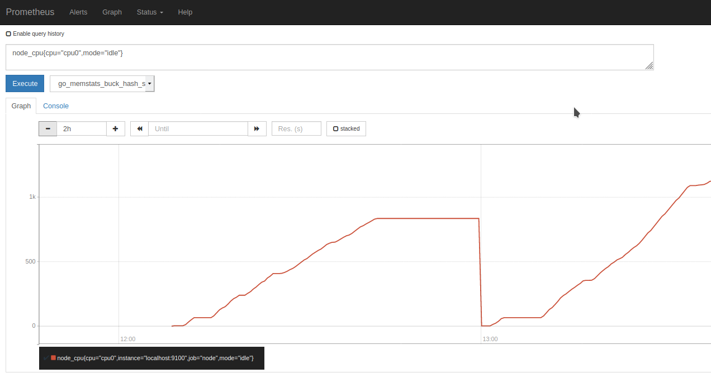
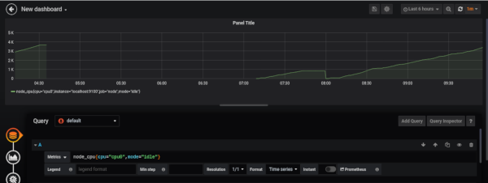

# Configuration

https://www.howtoforge.com/tutorial/how-to-install-prometheus-and-node-exporter-on-centos-8/

### Prerequisites

Il est possible de pouvoir suivre une metric dans un environnement

Example : node_cpu{cpu="cpu0",mode="idle"}


- [Prometheus](https://prometheus.io)
- [Node_exporter](https://prometheus.io/docs/guides/node-exporter/)
- [Grafana](grafana.com/)

## Testing Node_exporter

Pour voir les Metrics disponibles, ouvrez le navigateur et tapez ceci :

```
http://localhost:9100/metrics
```


## Testing Prometheus

```
http://localhost:9090/
```




## Testing Grafana

Dans le menu "data sources" de Grafana, choisissez Prometheus

Remplissez le formulaire et la ligne

url : http://\<ip\>:9090

Il faut aller dans le menu "New dashboard"...

- Sélectionnez l'affichage `graph`
- Sélectionné l'onglet `Queries`

Compléter les étapes pour voir le résultat


