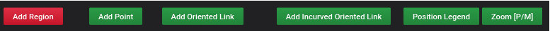
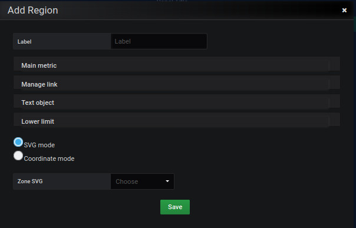

# region

Après avoir cliquer sur le bouton **region**

Un formulaire d'édition est proposé. L'ensemble de l'écran de saisie sont représentés comme ceci : 

L'édition de la région s'effectue à partir du formulaire de l'[éditeur Region](../editor/coordinates-space-region.md)

todo

