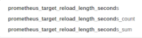
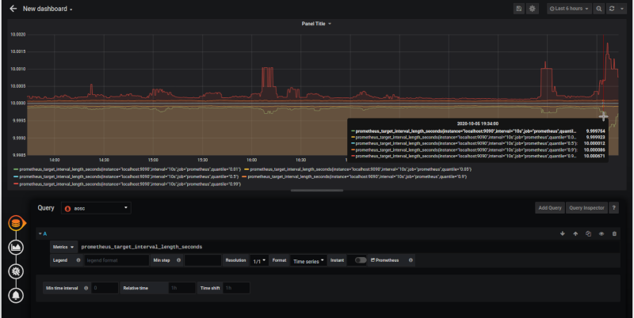
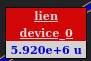
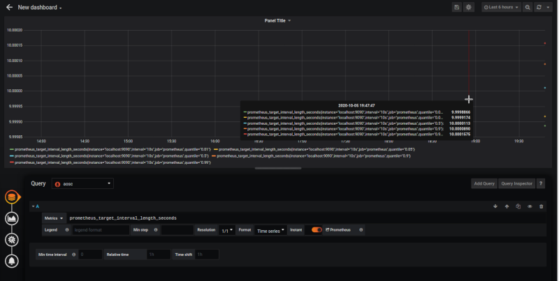
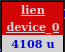

# Query

# Choisir votre requête

Vous pouvez choisir une requête comme celle-ci

En fonction de la requête que vous choisissez, vous pouvez manipuler le résultat dans le plugin.

>
> Par exemple : si vous sélectionnez `prometheus_target_reload_length_seconds`, vous pouvez avec la même requête afficher 3 objets différents dans le ` MainMetric`.
>

La requête est l'élément important car elle fournit le résultat et les éléments permettant de positionner l'objet affiché.

# Générer

Si vous choisissez une requête générique, cela donne le delta du résultat que vous pouvez obtenir comme ceci :

# Instantané

Lorsque vous cochez la case ʻInstant`, cela signifie que Grafana fournit la valeur de la requête au moment T.

Ce choix permet d'affiner le résultat. Vous pouvez dans le plugin définir dans la ligne "Manipulate" de "MainMetric" son comportement, par exemple la somme des valeurs pour obtenir le résultat suivant :

# Voir aussi

- [Tutorial 01 : Ajoutez SVG dans votre tableau de bord](../demo/tutorial01.md)
- [Tutorial 03 : Créer un dashboard avancé avec des liens directionnels](../demo/tutorial03.md)
- [Tutorial 05 : Créer une requête personnalisable](../demo/tutorial05.md)
