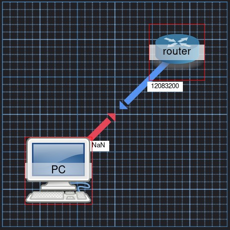
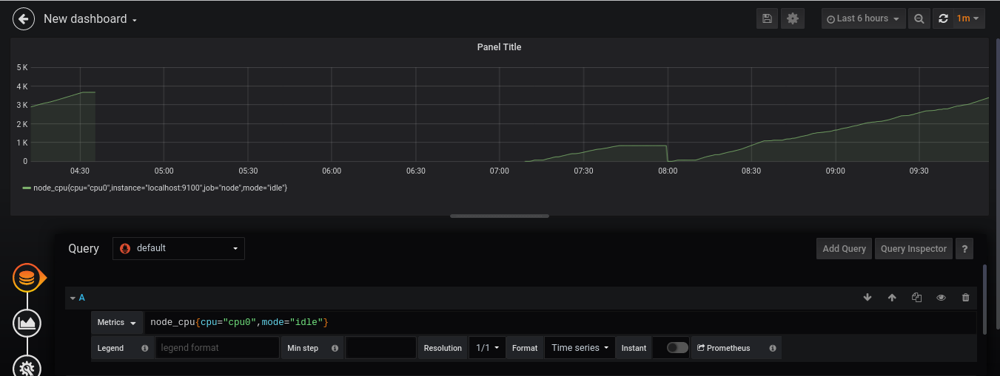
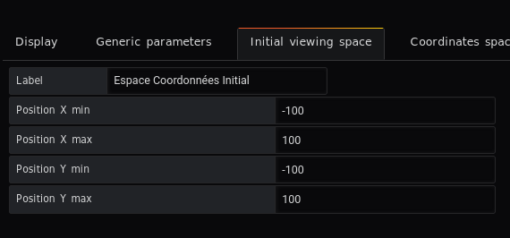
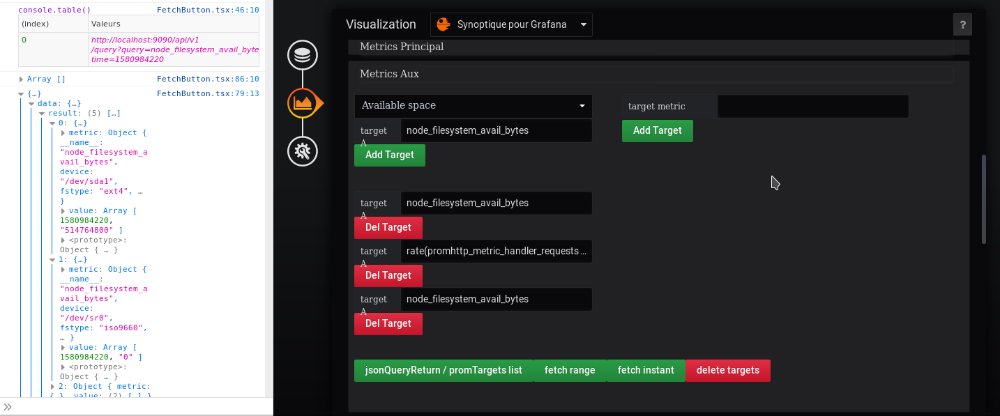

# Setup instructions

it's Draft

The current version proposes a representation between 2 nodes with a link and an associated value

Many settings are available to customize the rendering.



# Prerequisites

It is possible to see to follow a metric in an environment

Example : node_cpu{cpu="cpu0",mode="idle"}


- [Prometheus](https://prometheus.io)
- [Node_exporter](https://prometheus.io/docs/guides/node-exporter/)
- [Grafana](grafana.com/)

## Testing Node_exporter

To see the available metrics, open the browser and type this:

```sh
http://localhost:9100/metrics
```


## Testing Prometheus

```sh
http://localhost:9090/
```


## Testing Grafana

From the `data sources` menu in Grafana, choose Prometheus

Complete the form and the line

url : http://localhost:9090

You have to go to the `New dashboard` menu...

- Select the `graph` display
- Selected the `Queries` tab

Complete the targets to see the result




# Plugin WeatherMap

## Automatic view

coming soon

## Edit view

the configuration screen offers many tabs that are :

- Display
- Seuil
- Initial viewing space
- Visibility of objects
- Metrics Settings   


### Display

coming soon

### Seuil

coming soon

### Initial viewing space


Declaration Region

Tab `Initial vieving Space`




### Visibility of objects

coming soon

### Metrics Settings

* Tab Time Selector Display

Fill in the form

- TimeQuery: 2020-02-06 11:59:57
- Prometheus URL http://localhost:9090/api/v1/


* Tab Metrics Principal

Fill in the main metric


Example : node_cpu{cpu="cpu0",mode="idle"}

Currently the results are available in the console tab of the browser.


* Tab Metrics Auxiliaires

It is possible to add auxiliary metrics as shown in the screenshot



