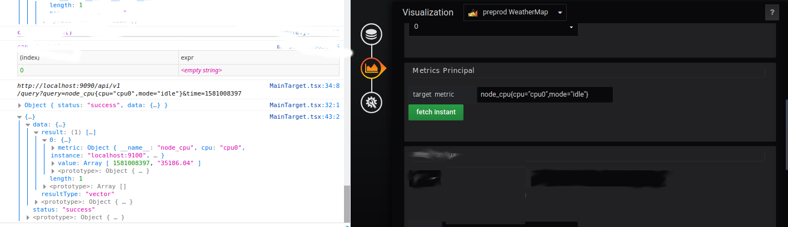

# region

### Initial viewing space

Declaration Region

Tab `Initial vieving Space`

### Visibility of objects

coming soon

### Metrics Settings

* Tab Time Selector Display

Fill in the form

- TimeQuery: 2020-02-06 11:59:57
- Prometheus URL http://localhost:9090/api/v1/

* Tab Metrics Principal

Fill in the main metric

Example : node_cpu{cpu="cpu0",mode="idle"}

Currently the results are available in the console tab of the browser.

* Tab Metrics Auxiliaires

It is possible to add auxiliary metrics as shown in the screenshot

