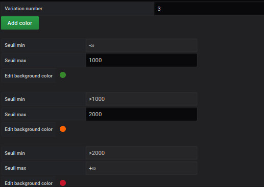

# lower limit

Cette partie est commune pour 

- Region
- Point

### fixe color

la couleur fixe

TODO

### variable color

si la `variable color`  est coché,
un nouveau formulaire apparaît pour définir le nombre de palier nécessaire comme ceci :

Renseigner le nombre de palier (par défaut 3)
Cliquez sur `add color`

Vous obtenez cet écran :

Chaque palier, vous devez remplir :

- Une valeur minimum
- Une valeur maximum
- Choisir une couleur intérieur
- choisir une couleur de bordure

