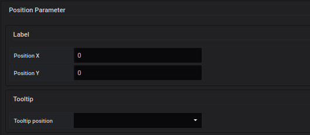

## oriented Link
Définir les coordonnées d'un oriented link

## Informations obligatoires

les informations obligatoires pour afficher les points sont : 

### Label 

il s'agit d'une clé permettant d'ajouter le résultat d'une valeur à des paramètres 

### orientation

2 orientations sont possibles : 

- monodirectionnel
- birectionnel

### Position

Un lien se fait par 2 points A et B

c'est pourquoi chaque point à ces coordoonées, en position X et Y

### Incurved

Il est possible d'ajouter un point pour faire une courbe incurved

pour cela, vous ajoutez un nouveau point en position X et Y

## Main metric

une page dédiée pour remplir les champs sont disponible [ici](coordinates-space-main-metric.md)

## Auxiliary metrics

to be continued...

## Manage link

une page dédiée pour remplir les champs sont disponible [ici](coordinates-manage-link.md)

## Text object

une page dédié pour remplir les champs sont disponible [ici](coordinates-text-object.md)

## lowerLimit

une page dédié pour remplir les champs sont disponible [ici](coordinates-lower-limit.md)

## Position Parameter

vous pouvez définir la position du paramètre 

  - la position du label en X et Y

  - la position tooltip : 
haut / bas....

  - layer level

