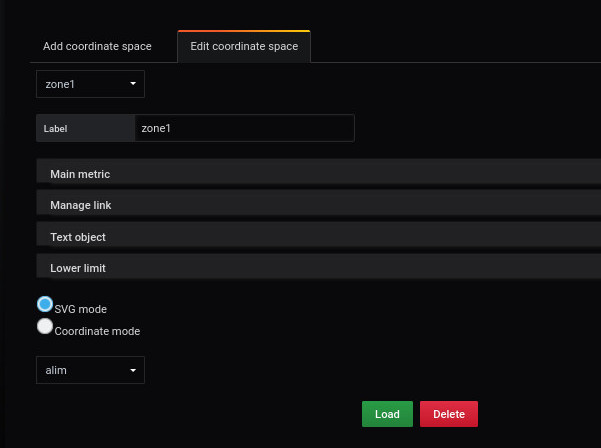
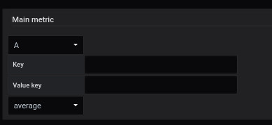

# Coordinates space

## region

### svg

Définir un élément SVG comme une région

### coordinate region

Définir les coordonnées d'une région

### lowerLimit

#### variable color

si la `variable color`  est coché,
un nouveau formulaire apparaît pour définir le nombre de palier nécessaire comme ceci :

Renseigner le nombre de palier (par défaut 3)
Cliquez sur `add color`

Vous obtenez cet écran :

Chaque palier, vous devez remplir :

- Une valeur minimum
- Une valeur maximum
- Choisir une couleur intérieur
- choisir une couleur de bordure

### Main metric

### Manage link

3 liens sont disponibles

- Following link

- Link tooltip

- Text in tooltip

### Text object

## point
Définir les coordonnées des points

TODO

## orientedLink
Définir les coordonnées d'un oriented link

TODO

