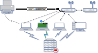
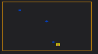
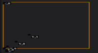

# Resource

The `dashboard` directory offers different examples for the WeatcherMap plugin of Grafana.

## Settings

the above demos were made with an associated server. The configuration of this one is explained on the dedicated page : [settings server](../EN/appendix/server.md)

## demo 1 : Add a dashboard SVG

The associated files you can import are =>

- Picture background SVG => [demo01-background.svg](demo01-background.svg)
- Displays a selected element SVG => [demo01-svgRegion.json](demo01-svgRegion.json)
- Adds points => [demo01-point.json](demo01-point.json)
- Adds links => [demo01-link.json](demo01-link.json)

To see the tutorial, [follow this link](../EN/demo/tutorial01.md)

## demo 2 : Add PNG/JPG in your dashboard

The associated files you can import are =>

- Picture background SVG => file [demo02-background.jpg](demo02-background.jpg)
- Displays a selected coordinate region => [demo02-CoorRegion.json](demo02-CoorRegion.json)
- Add links => [demo02-link.json](demo02-link.json)

To see the tutorial, [follow this link](../docs/EN/demo/tutorial02.md)

## demo 3 : Create an advanced dashboard with directional links

The associated files you can import are =>

- Add region => [demo03-region.json](demo03-region.json)
- Add points => [demo03-point.json](demo03-point.json)
- Add links => [demo03-links.json](demo03-links.json)

To see the tutorial, [follow this link](../docs/EN/demo/tutorial03.md)

## demo 4 : How to create and add your own SVG image in Grafana

- Image SVG [demo04-background.svg](demo04-background.svg)

To see the tutorial, [follow this link](../docs/EN/demo/tutorial04.md)

## demo 5 : Create a customizable query

The associated files you can import are =>

- Picture background SVG => [demo05-background.svg](demo05-background.svg)
- query : rate(go_memstats_alloc_bytes[5m])
- Displays a selected element SVG and selected region => [demo05-region.json](demo05-region.json)

To see the tutorial, [follow this link](../docs/EN/demo/tutorial05.md)

## demo 6 : Create advanced modeling

The associated files you can import are =>

- Picture background SVG => [demo01-background.svg](demo01-background.svg)
- Displays a selected element SVG and selected region => [demo06-region.json](demo06-region.json)
- query A : node_cpu_frequency_hertz
- query B : node_network_carrier_changes_total

To see the tutorial, [follow this link](../docs/EN/demo/tutorial4.md)

## demo 7 : Create a customizable query avanced

The associated files you can import are =>

- Picture background SVG => [demo07-background.svg](demo07-background.svg)
- Add SVG region => [demo07-region-svg.json](demo07-region-svg.json)
- Add coord region => [demo07-region-coord.json](demo07-region-coord.json)
- Add link => [demo07-link.json](demo07-link.json)

To see the tutorial, [follow this link](../docs/EN/demo/tutorial07.md)

## demo 8 : How to use auxiliere metric

The associated files you can import are =>

- Picture background SVG => [demo01-background.svg](demo01-background.svg)
- Add points => [demo08-point.json](demo08-point.json)

To see the tutorial, [follow this link](../docs/EN/demo/tutorial08.md)

## demo 9 : Create link bi directionnel

The associated files you can import are =>

- Picture background SVG => [demo01-background.svg](demo01-background.svg)
- Add region => [demo09-region.json](demo09-region.json)

To see the tutorial, [follow this link](../docs/EN/demo/tutorial09.md)

## demo 10 : How to add a global json file

The associated files you can import are =>

- demo 1 => [demo10-01-global.json](demo10-01-global.json)
- demo 2 => [demo10-02-global.json](demo10-02-global.json)
- demo 3 => [demo10-03-global.json](demo10-03-global.json)

To see the tutorial, [follow this link](../docs/EN/demo/tutorial10.md)

## demo 11 : How to change initial viewing space

The associated files you can import are =>

- No files 

To see the tutorial, [follow this link](../docs/EN/demo/tutorial11.md)

## demo 12 : Building your dashboard from your computer

The associated files you can import are =>

To see the tutorial, [follow this link](../docs/EN/demo/tutorial12.md)

## demo 13 : Dynamic gabarit

The associated files you can import are =>

- Add gabarit default => [demo13-default.json](demo13-default.json)
- Add template point => [demo13-point.json](demo13-point.json)
- Add template point and link => [demo13-point-link.json](demo13-point-link.json)

To see the tutorial, [follow this link](../docs/EN/demo/tutorial13.md)

## demo 14 : Advanced dynamic template

The associated files you can import are =>

- Picture background SVG => [demo07-background.svg](demo14-background.svg)
- Add gabarit default => [demo14-default.json](demo14-default.json)
- Add template Region => [demo14-svg.json](demo14-svg.json)

To see the tutorial, [follow this link](../docs/EN/demo/tutorial14.md)

## demo 15 : Multiple gabarit loading

The associated files you can import are =>

- Add gabarit default => [demo15-default.json](demo15-default.json)
- Add gabarit multi-point => [demo15-point-multi.json](demo15-point-multi.json)

To see the tutorial, [follow this link](../docs/EN/demo/tutorial15.md)

